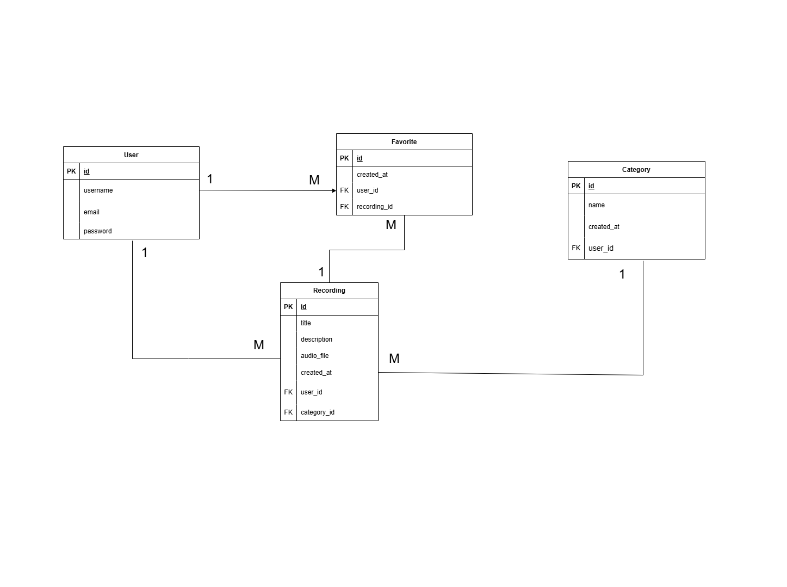
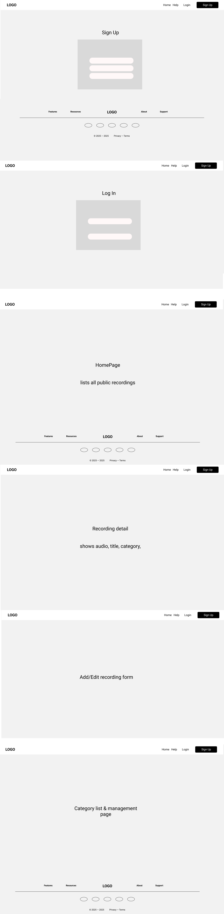

# Nature Sound Recorder - Backend


This is the **backend** repository for the Nature Sound Recorder project. The application serves as the backend to manage user accounts, audio recordings, categories, and interactions between users.

---

## Project Description

is a web application that allows users to record natural sounds such as rain, birds, and ocean waves, categorize them, and view recordings made by others.

* Sign up and log in using **JWT authentication**
* Upload, edit, and delete **audio recordings**
* View a list of all recordings
* Filter recordings by **category**
* Mark and view **favorite recordings**

---

## Repository Link

**Frontend Repository:** [Nature Sound Recorder - Frontend](https://github.com/RaghadAbdullah-maker/nature-sound-recorder-frontend.git)

---

## Tech Stack

* **Django** (Backend Framework)
* **Django REST Framework** (API)
* **PostgreSQL** (Database)
* **JWT Authentication** (Token-based auth)
* **Pillow** (Image handling for user avatars)
* **CORS Headers** (Cross-origin resource sharing)
* **Docker** (Containerization)

---

## Installation Instructions

### 1. Clone the Repository

```bash
git clone https://github.com/your-username/nature-sound-recorder-backend.git
cd nature-sound-recorder-backend

### 2. Set Up the Virtual Environment

python3 -m venv venv


### 3. Install Dependencies

pipenv install

### 4. Set Up Environment Variables

Create a `.env` file

### 5. Apply Migrations

python manage.py migrate

### 6. Run the Development Server

python manage.py runserver

## API Documentation

### Authentication

| Method | Endpoint                | Description                          |
|--------|-------------------------|--------------------------------------|
| POST   | `/api/auth/signup/`     | Register a new user                  |
| POST   | `/api/auth/login/`      | Log in to an existing account, returns JWT token |

### Recordings

| Method | Endpoint                      | Description                          |
|--------|-------------------------------|--------------------------------------|
| GET    | `/api/recordings/`            | Get a list of all recordings         |
| POST   | `/api/recordings/`            | Upload a new recording (JWT required)|
| GET    | `/api/recordings/{id}/`       | Get details of a specific recording  |
| PATCH  | `/api/recordings/{id}/`       | Edit a specific recording            |
| DELETE | `/api/recordings/{id}/`       | Delete a specific recording          |

### Categories

| Method | Endpoint                | Description                          |
|--------|-------------------------|--------------------------------------|
| GET    | `/api/categories/`      | Get a list of all categories         |
| POST   | `/api/categories/`      | Create a new category (admin only)   |

### Favorites

| Method | Endpoint                      | Description                          |
|--------|-------------------------------|--------------------------------------|
| POST   | `/api/favorites/`             | Add a recording to favorites         |
| DELETE | `/api/favorites/{id}/`        | Remove a recording from favorites    |


---

## ERD


## wireframe


---

## IceBox Features

 1. User Profiles: Personalized user profiles. 
 2. Search: Search recordings by tags, titles, or descriptions. 
 3. Improved Favorites: Organize and manage favorite recordings. 
 4. Comments and Ratings: Allow users to comment and rate recordings. 
 5. Audio Preview: Preview recordings before saving or viewing details. 
 6. Map Feature: Show where each sound was recorded. 
 7. Likes: Enable liking recordings. 

---

## How to Use the App

1. Set up the backend server (see installation instructions above)
2. Connect the frontend to the backend API.
3. Use the API to manage recordings, categories, and user interactions.


---

## Developed By

**Raghad Alhazmi**

---

